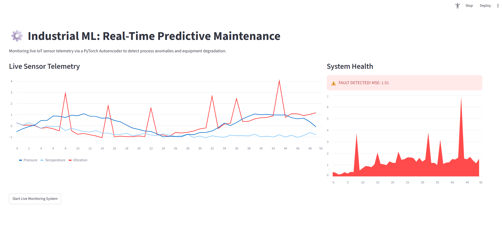

# Industrial ML: Streaming Predictive Maintenance Engine ⚙️

A real-time anomaly detection application that monitors live IoT sensor telemetry using a PyTorch Autoencoder to predict equipment degradation and process faults.

## 🚀 The Objective
To demonstrate an end-to-end industrial machine learning pipeline capable of processing high-frequency streaming data. The system uses a deep learning autoencoder to learn the baseline operational signature of machinery. When unseen mechanical faults occur (e.g., severe vibration spikes), the model fails to reconstruct the signal, triggering a high Mean Squared Error (MSE) anomaly alert in real-time.

## 🛠️ Tech Stack
* **Deep Learning:** PyTorch, Neural Network Autoencoders
* **Frontend & Streaming:** Streamlit
* **Data Processing:** NumPy, Pandas

## 🏗️ System Architecture
1. **Live Data Simulation:** A continuous stream of multivariable sensor data (Vibration, Temperature, Pressure) is generated, injecting periodic, random mechanical faults.
2. **Inference Engine:** The PyTorch Autoencoder compresses the 3D sensor input into a 1D latent space and attempts reconstruction. 
3. **Anomaly Scoring:** The MSE loss between the original and reconstructed signal serves as the real-time anomaly score.
4. **Dynamic UI:** Streamlit renders the sliding-window telemetry and anomaly scores simultaneously, triggering visual alerts when the MSE breaches the safety threshold.

## 💻 How to Run Locally

1. Clone the repository:
   ```bash
   git clone https://github.com/AhadAshfaq/Industrial-ML-Predictive-Maintenance-Engine.git
   cd industrial-predictive-maintenance
   ```

2. Install the required dependencies:
   ```bash
   pip install streamlit torch numpy pandas
   ```

3. Launch the real-time monitoring dashboard:
   ```bash
   streamlit run app.py
   ```

**📸 Live Monitoring Interface**


